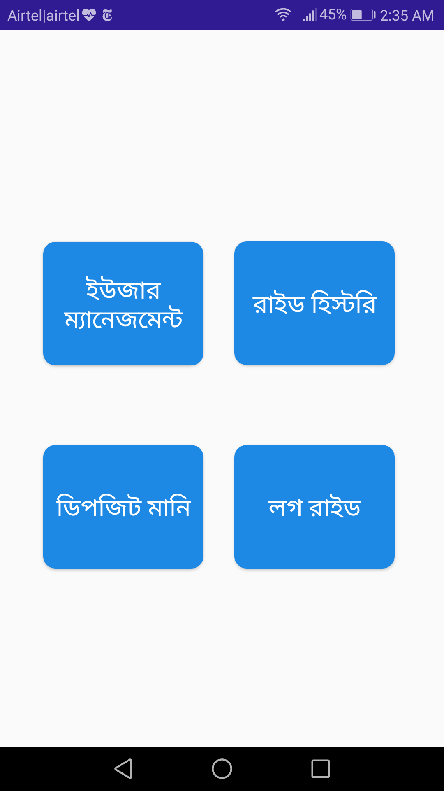

# BikeBharaUI

A project I made as an assignment during my internship in Prime Tech Solutions during the summer of 2018.
The project also consist of online database from google firebase. 
I made a restful api using google firebase
which holds the information of a customer and a biker. 
moreover, they can keep a record of their transaction between them

